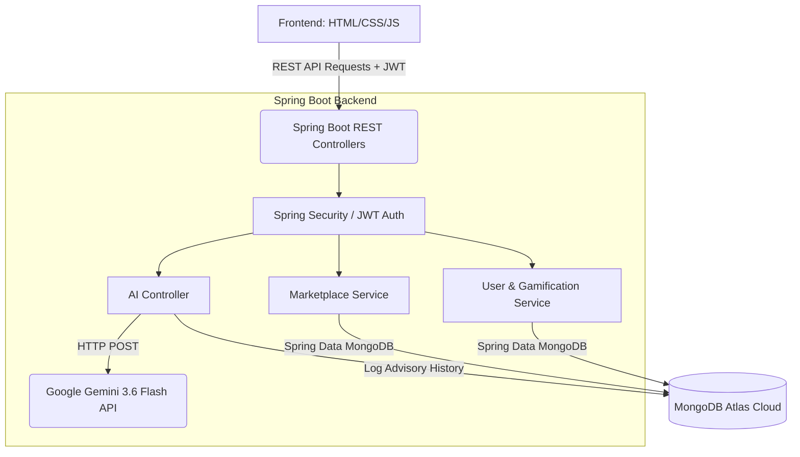

# 🌱 FarmVerse: Precision Agriculture Management Platform


## 📖 Executive Summary
**FarmVerse** is a robust, full-stack Precision Agriculture Management Platform designed to empower modern farmers by bringing cutting-edge technology directly to the field. Agriculture remains a critical economic sector, yet traditional farming suffers from fragmented management, delayed disease detection, and exploitation by middlemen. 

FarmVerse bridges the gap between traditional farming and modern software solutions by serving as a unified ecosystem. It integrates **Cloud NoSQL data management, Gamified Analytics, Direct Marketplace trading, and Real-time Generative AI** to optimize yields, simplify agricultural commerce, and drive data-backed decision-making.

---

## ✨ Key Innovations & Core Features

### 1. 🤖 Smart AI Agricultural Advisor (Powered by Gemini 3.6 Flash)
Unlike traditional static chatbots, FarmVerse integrates directly with **Google's Gemini 3.6 Flash AI API**. Farmers can ask highly specific questions regarding weather delays, pest control, or NPK fertilizer ratios, and receive instant, context-aware, generative AI advice tailored to their specific crop scenarios.

### 2. 🎮 Gamified Farmer Engagement
To drive daily active usage, the platform features a highly interactive **Gamification Engine**. Farmers earn XP (Experience Points) and level up by completing daily agricultural missions, checking analytics, and utilizing the AI advisor. 

### 3. 🛒 Direct-to-Buyer Digital Marketplace
Eliminating the need for traditional middlemen, FarmVerse includes a robust Farmer's Marketplace. Farmers can securely list their harvest, connect directly with buyers, and manage their agricultural commerce within a moderated ecosystem.

### 4. 🔐 Enterprise-Grade Security
Built with **Spring Security and JWT (JSON Web Tokens)**, the platform enforces strict Role-Based Access Control (RBAC). It isolates data securely across different user roles including Farmers, Administrators, and Agricultural Experts.

---

## 🛠️ Technology Stack

| Component | Technology Used | Description |
| :--- | :--- | :--- |
| **Frontend** | HTML5, CSS3, Vanilla JS | Lightweight, high-performance, responsive UI without heavy framework overhead. |
| **Backend** | Java 21, Spring Boot | Robust, scalable enterprise REST API handling business logic and security. |
| **Database** | MongoDB Atlas | Cloud-hosted NoSQL document database for flexible, scalable data storage. |
| **AI Engine** | Google Gemini API | `gemini-3.6-flash` model accessed via Spring `RestTemplate` for generative advisory. |
| **Security** | Spring Security, JWT | Stateless, secure authentication and authorization pipeline. |

---

## 🏗️ System Architecture



---

## 🚀 Installation & Setup Guide

### Prerequisites
- **Java JDK 21+** installed.
- **Maven** installed.
- A valid **Google Gemini API Key** (`AIzaSy...`).
- A **MongoDB Atlas** Cluster.

### Local Environment Setup
1. **Clone the repository:**
   ```bash
   git clone https://github.com/YourUsername/FarmVerse.git
   cd FarmVerse
   ```

2. **Set Environment Variables:**
   The application requires secure credentials to be injected via environment variables prior to runtime.
   
   **Windows (PowerShell):**
   ```powershell
   $env:GEMINI_API_KEY="AIzaSy_YOUR_API_KEY"
   $env:MONGO_PASSWORD="your_mongo_password"
   ```
   **Linux/Mac (Bash):**
   ```bash
   export GEMINI_API_KEY="AIzaSy_YOUR_API_KEY"
   export MONGO_PASSWORD="your_mongo_password"
   ```

3. **Compile & Run:**
   ```bash
   mvn clean verify
   mvn spring-boot:run
   ```

4. **Access the Application:**
   Open your browser and navigate to `http://localhost:8082`

---

## 🔮 Future Scope
- **IoT Sensor Integration:** Real-time ingestion of soil moisture and NPK sensor data directly into the dashboard.
- **AI Vision Diagnostics:** Expanding the Gemini integration to support multimodal vision, allowing farmers to upload images of diseased crops for instant identification.
- **Government Scheme Integration:** Automated alerts for local agricultural subsidies and policy changes.

---

## 👥 Team Credentials
- **Project Name:** FarmVerse
- **Presented by:** Team C
- **Project Guide:** Ragul S
- **Domain:** Agriculture, Food Tech & Rural Development

---
*Empowering the farmers of today with the technology of tomorrow.*
